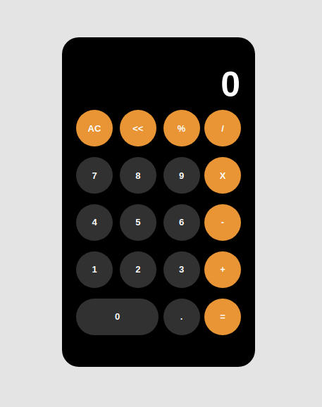

# Calculator

## Descrição

Este projeto trata-se de uma calculadora feita em react para fins de prática do framework.

O projeto consiste em uma calculadora com as 4 operações básicas (adição, subtração, multiplicação e divisão) elém de conter funções como: apagar os últimos caracteres adicionados, limpar toda a tela e cálculo de porcentagem.

## Screenshot

